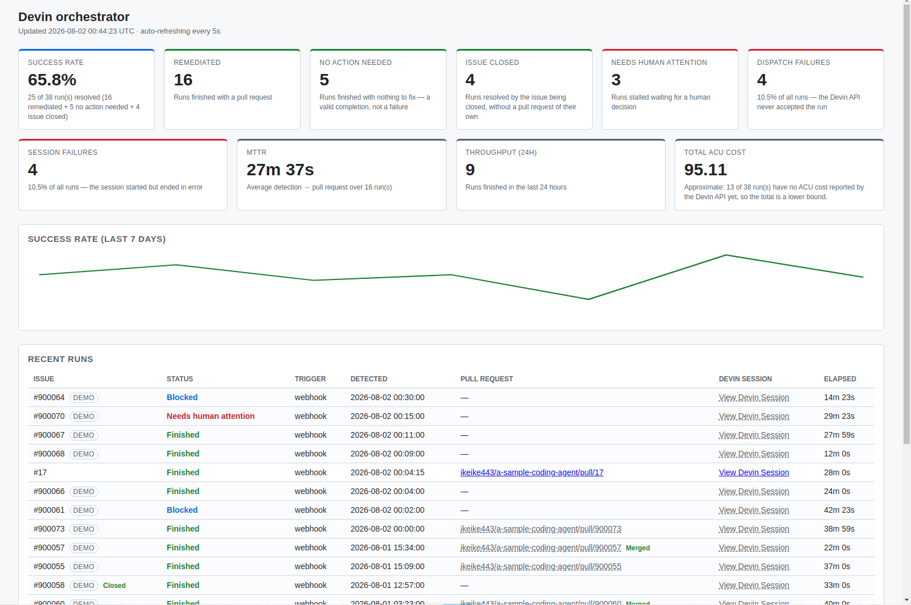

# devin-orchestrator

An event-driven automation orchestrator built on top of the Devin API. It receives GitHub Issue and
Pull Request events via webhooks, decides which Devin sessions to start, tracks those sessions, and
stores their outcomes (success rate, latency, cost) so they can be visualised on a dashboard.

The HTTP server, directory layout, Docker setup, test harness and CI pipeline are in place, and the
GitHub webhook intake, the Devin V3 API client, the observability layer (SQLite store, polling
worker, metrics API) and the dashboard UI are implemented.

Dashboard: <http://localhost:3000/dashboard>

## Demo



The screenshot above is a dashboard filled with **seeded demo data** so every card, the 7-day trend
and the recent-runs table have something to show.

- Rows whose issue number is **`#900xxx`** (900000 and up) and that carry a grey **DEMO** badge are
  fake data written by [`npm run seed`](#seeding-demo-data). Their pull request and Devin session
  cells are **not clickable**: they are rendered as grey, dashed-underlined text instead of links,
  because the URLs they point at do not exist.
- **Real runs are the ones without a DEMO badge**, with ordinary GitHub issue numbers. They appear
  above the seeded rows as long as they are more recent (the table is sorted newest first), and
  their pull request and Devin session links are normal blue, clickable links.

See [Seeding demo data](#seeding-demo-data) for how to create and remove the seeded rows.

## Architecture

```
        ┌───────────────────┐
Event   │  Event trigger    │   GitHub Issue/PR webhook (HMAC-signed)
trigger │  POST /webhook/…  │
        └─────────┬─────────┘
                  │ verify → dedupe → normalise
                  ▼
        ┌───────────────────┐        ┌───────────────────────┐
        │   Orchestrator    │ record │   Observability store  │
        │   dispatchToDevin ├───────▶│   (SQLite: runs table) │
        └─────────┬─────────┘        └───────────┬────────────┘
                  │ POST /sessions               │ read
                  ▼                               ▼
        ┌───────────────────┐        ┌───────────────────────┐
        │  Devin session    │        │  Outputs               │
        │  (V3 API)         │        │  GET /dashboard        │
        └─────────┬─────────┘        │  GET /dashboard/metrics│
                  │                   └───────────▲────────────┘
                  │ poll GET /sessions/{id}       │ status, PR, ACU cost
                  └───────────────────────────────┘
                       SessionPoller (background worker)
```

An HMAC-signed webhook is verified, deduplicated and normalised, then the orchestrator records the
run and starts a Devin session. A background `SessionPoller` refreshes each active session from the
Devin API and writes status, PR URL and ACU cost back into the observability store, which the
dashboard reads.

## GitHub webhook intake

`POST /webhook/github` performs the following steps:

1. **Signature verification** — the raw request body (kept as a `Buffer` by a custom
   `application/json` content type parser) is HMAC-SHA256 signed with `GITHUB_WEBHOOK_SECRET` using
   Node's `node:crypto` and compared against `X-Hub-Signature-256` in constant time. A missing or
   mismatching signature yields `401`.
2. **Deduplication** — `X-GitHub-Delivery` is looked up in an in-memory TTL cache
   (`WEBHOOK_DEDUPE_TTL_MS`, 10 minutes by default). A redelivery inside the window returns `200`
   without further processing. Persisting delivery ids is left to the observability store.
3. **Normalisation** — `X-GitHub-Event` selects the handler for `issues`, `issue_comment` and
   `pull_request`. Only `issues` deliveries with `action: labeled` and the `devin-remediate` label
   are actionable; every other delivery is logged and acknowledged with `200` so GitHub does not
   see an error.
4. **Dispatch** — actionable events are passed to `dispatchToDevin()` in `src/webhook/dispatch.ts`
   without awaiting it, so the handler responds immediately. It builds a prompt from the issue and
   repository, creates a Devin session tagged
   `["remediation", "trigger-webhook", "issue-<number>"]` with `max_acu_limit` taken from
   `DEVIN_MAX_ACU_LIMIT`, and logs the resulting `session_id`. Every actionable delivery is recorded
   in the observability store as `pending` before the call, then moved to `working` with the
   `session_id`, or to `dispatch_failed` with the error message if the Devin API call fails after
   all retries. The webhook has already answered `200` so GitHub does not redeliver; the failure is
   visible on `GET /dashboard/metrics` instead of in the logs only.

## Technology choices

### HTTP framework: Fastify

- **Performance**: webhook traffic arrives in bursts, and Fastify's low-overhead routing and JSON
  serialisation handle that better than Express.
- **TypeScript first**: type definitions ship with the framework, so there is no separate
  `@types/*` package to drift out of sync and everything compiles under `strict`.
- **Plugin encapsulation**: `register()` gives each component its own scope and prefix, which maps
  cleanly onto the webhook / dashboard split this project grows into.
- **Testability**: `app.inject()` exercises routes at the HTTP level without binding a port.
- **Webhook signature verification**: raw-body access via `addContentTypeParser` / `onRequest` hooks
  is built in, which is what HMAC verification of GitHub deliveries needs.

### Test framework: Vitest

- **Native TypeScript / ESM**: runs ESM + TS sources directly, with no `ts-jest` or Babel layer.
- **Fast**: esbuild-based transforms and parallel workers keep CI runs short.
- **Jest-compatible API**: `describe` / `it` / `expect` work as usual, so there is nothing new to
  learn and migrating to Jest later would be straightforward.
- **Minimal configuration**: a single `vitest.config.ts`, no extra transformer wiring.

## Running locally

### Docker Compose (recommended)

```bash
cp .env.example .env   # set at least GITHUB_WEBHOOK_SECRET
docker compose up --build
curl http://localhost:3000/health   # => {"status":"ok","uptime":...}
```

`GITHUB_WEBHOOK_SECRET` is required: the server aborts at startup if it is unset (see
[Environment variables](#environment-variables)). The `orchestrator-data` volume is mounted at
`/app/data` for SQLite persistence, and Compose runs a `GET /health` healthcheck against the
container.

#### Simulating a webhook end to end

With the stack running, send a signed `issues`/`labeled` delivery and watch it appear on the
dashboard:

```bash
SECRET="your-webhook-secret"   # must match GITHUB_WEBHOOK_SECRET
BODY='{"action":"labeled","label":{"name":"devin-remediate"},"repository":{"full_name":"ikeike443/a-sample-coding-agent"},"issue":{"number":1,"labels":[{"name":"devin-remediate"}]}}'
SIG="sha256=$(printf '%s' "$BODY" | openssl dgst -sha256 -hmac "$SECRET" | sed 's/^.* //')"

curl -sS http://localhost:3000/webhook/github \
  -H "content-type: application/json" \
  -H "x-github-event: issues" \
  -H "x-github-delivery: demo-1" \
  -H "x-hub-signature-256: $SIG" \
  -d "$BODY"

curl -sS http://localhost:3000/dashboard/metrics   # totalRuns reflects the delivery
open http://localhost:3000/dashboard               # or visit in a browser
```

Without Devin credentials the run is recorded as `dispatch_failed` (still visible on the dashboard);
with `DEVIN_API_KEY` / `DEVIN_ORG_ID` set it becomes a `working` run tracked by the poller.

### Node.js directly

```bash
npm ci
npm run dev      # development server via tsx watch
npm test         # Vitest
npm run lint     # ESLint
npm run build && npm start
npm run seed     # fake dashboard runs for the last 7 days (SEED_DAYS / SEED_SEED / DATABASE_URL)
```

In the production image `tsx` is absent; use the compiled seed instead — see
[Seeding the deployed dashboard](#seeding-the-deployed-dashboard).

## Endpoints

All endpoints are implemented.

| Method | Path                 | Description                                    |
| ------ | -------------------- | ----------------------------------------- |
| GET    | `/health`            | Liveness/health probe; 200 `{"status":"ok","uptime":n}` (used by the Docker and Render healthchecks) |
| POST   | `/webhook/github`    | HMAC-verified intake, dedupe, normalisation and Devin session creation |
| GET    | `/dashboard/metrics` | Success rate, failure breakdown, MTTR, throughput and ACU cost, plus the rendered `view` model |
| GET    | `/dashboard`         | Auto-refreshing HTML dashboard (and its static assets) |

## Layout

```
src/
  index.ts          entrypoint (env validation, server startup, graceful shutdown)
  app.ts            Fastify instance, route registration and poller lifecycle
  config.ts         environment variable loading and startup validation
  webhook/          Issue/PR webhook intake
  devin-client/     Devin V3 API wrapper
  observability/    SQLite run store, metrics and polling worker
  dashboard/        dashboard UI (page + assets) and metrics API
tests/              Vitest test suite (unit + the webhook→store→metrics integration test)
Dockerfile          multi-stage, non-root production image
docker-compose.yml  local containerised run (SQLite volume + healthcheck)
render.yaml         Render Blueprint (Docker web service + persistent disk)
```

`buildApp()` wires the health check, the webhook and dashboard routes and the observability
`SessionPoller`. The poller starts automatically once the server is ready (when Devin credentials
are configured) and is drained on shutdown; see [Graceful shutdown](#graceful-shutdown).

- **`src/webhook/`**: GitHub webhook signature verification (`GITHUB_WEBHOOK_SECRET`), normalisation
  of `issues` / `issue_comment` / `pull_request` events, delivery deduplication and dispatch to
  downstream handling.
- **`src/devin-client/`**: implemented wrapper around the Devin V3 API. `DevinClient` is scoped to
  `https://api.devin.ai/v3/organizations/{DEVIN_ORG_ID}` (override the root with
  `DEVIN_API_BASE_URL`) and authenticates with `DEVIN_API_KEY` as a bearer token. It uses Node's
  built-in `fetch` (injectable for tests) and exposes:
  - `createSession({ prompt, tags, playbookId, maxAcuLimit, structuredOutputSchema, structuredOutputRequired, title, idempotent })`
    → `POST /sessions`, returning `session_id` and `url`;
  - `createRemediationSession(params)` → the same call with
    `structured_output_required: true` and the remediation schema
    (`outcome: pr_created | no_action_needed | blocked_on_question`, `summary`, nullable `pr_url`)
    always attached. This is what the webhook dispatch uses: without a required structured output a
    session that decides nothing needs fixing never ends its turn and idles as `blocked` forever;
  - `getSession(sessionId)` → `GET /sessions/{id}`, returning `status`, `structured_output`,
    `pull_requests` and `acus_consumed`;
  - `sendMessage(sessionId, message)` → `POST /sessions/{id}/messages`.

  Network failures, 5xx responses and `429` are retried with an exponential backoff
  (`DEVIN_MAX_RETRIES`, 3 by default, `0` disables retries; `DEVIN_RETRY_INITIAL_DELAY_MS`, 1s then
  2s, 4s, …). Other 4xx responses are raised immediately as a `DevinApiError` carrying the status
  and a truncated body. Every request carries an abort timeout (`DEVIN_REQUEST_TIMEOUT_MS`, 30s).
  Session creation from the webhook sets `idempotent: true` so a retried `POST /sessions` cannot
  start a second remediation run. Each backoff delay carries ±20% jitter (`backoffDelay()`), so
  concurrent clients retrying a failing Devin API do not hit it in lockstep.
- **`src/observability/`**: implemented. SQLite persistence of runs, metric computation and the
  background polling worker — see [Observability](#observability).
- **`src/dashboard/`**: implemented — see [Dashboard](#dashboard). `view-model.ts` turns the metrics
  and the run history into everything the page displays (summary cards, the recent-runs table rows,
  status colour buckets, the success-rate trend); `index.ts` serves that view model on
  `GET /dashboard/metrics` alongside the raw metrics, and serves the page and its assets from
  `src/dashboard/public/`.

## Observability

### Data model

`src/observability/store.ts` opens the SQLite database at `DATABASE_URL` (`file:` prefix optional,
`:memory:` supported) via `better-sqlite3` and owns a single table:

| Column                | Type    | Notes                                                                        |
| --------------------- | ------- | ---------------------------------------------------------------------------- |
| `run_id`              | TEXT PK | UUID generated when the event is detected                                     |
| `issue_ref`           | INTEGER | GitHub issue number, nullable                                                 |
| `trigger_type`        | TEXT    | `webhook` \| `schedule`                                                       |
| `session_id`          | TEXT    | Devin session id; **null when the Devin API call itself failed**              |
| `tags`                | TEXT    | JSON array of the session tags                                                |
| `detected_at`         | TEXT    | ISO-8601, set on intake                                                       |
| `session_started_at`  | TEXT    | ISO-8601, set when the session was created                                    |
| `session_finished_at` | TEXT    | ISO-8601, set when the session reached a terminal state                       |
| `status`              | TEXT    | `pending` \| `dispatch_failed` \| `working` \| `blocked` \| `needs_human_attention` \| `finished` \| `failed` |
| `pr_url`              | TEXT    | Pull request opened by the session, nullable                                  |
| `pr_url_recorded_at`  | TEXT    | ISO-8601 stamp of when `pr_url` was first seen; the MTTR end point            |
| `pr_merged_at`        | TEXT    | Always null today, see below                                                  |
| `acu_cost`            | REAL    | `acus_consumed` reported by the Devin API, nullable                           |
| `error_message`       | TEXT    | Dispatch or session error, nullable                                           |
| `outcome`             | TEXT    | `pr_created` \| `no_action_needed` \| `blocked_on_question` from the structured output, nullable |
| `blocked_since`       | TEXT    | ISO-8601 stamp of the first blocked poll; cleared when the run leaves the blocked states |

### Lifecycle

1. `pending` — written by the webhook dispatcher as soon as an actionable delivery arrives.
2. `dispatch_failed` — the Devin API rejected or never answered `POST /sessions` (or no Devin
   credentials are configured). `session_id` stays null and `error_message` explains why.
3. `working` — the session was created; `session_id` and `session_started_at` are stored.
4. `blocked` / `needs_human_attention` / `finished` / `failed` — written by the polling worker from
   the Devin session status (`suspended`/`blocked` → `blocked`, `exit` → `finished`,
   `error` → `failed`).

### Polling worker

`SessionPoller` (started by `buildApp()` once the server is ready, interval `POLL_INTERVAL_MS`,
30s by default) calls
`GET /sessions/{id}` for every `working` / `blocked` / `needs_human_attention` run and stores the
new status, the reported `outcome`, the ACU cost and the pull request URL (`pull_requests[0].pr_url`,
falling back to `structured_output.pr_url`).

A session the API still reports as blocked is resolved from its structured output:

- `pr_created` / `no_action_needed` → `finished` (the session reached a conclusion and ended its
  turn; `no_action_needed` is a legitimate completion without a pull request);
- `blocked_on_question` → `needs_human_attention`;
- no structured output yet → stays `blocked` until it has been blocked for longer than the grace
  period (`BLOCKED_GRACE_MS`, 10 minutes by default), after which it becomes
  `needs_human_attention`. `needs_human_attention` runs keep being polled, so a human answering the
  session still moves it to a terminal status.

Tracking stops at that point: the Devin API does not report whether the pull request was merged, so
`pr_merged_at` stays null until a GitHub-side integration (polling the PR, or a `pull_request`
`closed`/`merged` webhook) is added — that is deliberately out of scope for this session.

### Metrics

`computeMetrics()` aggregates the whole `runs` table and backs `GET /dashboard/metrics`:

- **success rate** — `(remediated + no_action_needed) / totalRuns`; it measures whether Devin
  completed the run on its own, not merely whether a pull request exists, so a legitimate "nothing
  to fix" conclusion no longer counts as a failure;
- **outcome breakdown** — `remediated` (finished with a pull request), `noActionNeeded` (finished
  with nothing to fix) and `needsHumanAttention` (stalled waiting for a human);
- **failure breakdown** — `dispatch_failed` and `failed` counts and rates reported separately, so a
  broken dispatch path (Devin API down) is distinguishable from sessions that ran and failed;
- **MTTR** — average of `pr_url_recorded_at - detected_at` over the runs that produced a PR;
- **throughput** — `finished` runs in the last 24 hours;
- **cost** — sum of `acu_cost`, with `estimated: true` and a note whenever some runs have no ACU
  cost reported yet, in which case the total is a lower bound.

```bash
curl http://localhost:3000/dashboard/metrics
```

## Dashboard

Open <http://localhost:3000/dashboard> (`docker compose up --build` or `npm run dev`).

- **Summary cards** — success rate (with the remediated / no-action-needed split in its detail
  line), remediated, no action needed and needs human attention, dispatch failures and session
  failures **as separate cards**
  (so a permanently broken Devin API is visible at a glance rather than hidden in a single failure
  number), MTTR, throughput over the last 24 hours and the total ACU cost, annotated as approximate
  whenever some runs have no cost reported yet.
- **Recent runs table** — the 20 newest runs with issue number, colour-coded status
  (finished = green, working/blocked = blue, needs_human_attention/dispatch_failed/failed = red,
  pending = grey), trigger
  type, detection time, pull request link and elapsed time.
- **Trend** — a minimal inline SVG line chart of the daily success rate over the last 7 days. Days
  without any run carry `successRate: null` and break the line instead of being drawn at 0%.
- **Empty state** — with no history the page shows “まだ実行がありません / No runs recorded yet.”
  instead of an empty table.
- **Live updates** — the page polls `GET /dashboard/metrics` every 5 seconds and repaints; no manual
  reload is needed.

The page is plain HTML, CSS and a browser-native ES module (no UI framework or chart library). All
formatting and colour decisions live in `src/dashboard/view-model.ts` on the server, so the browser
script only writes DOM nodes and the display logic is covered by Vitest
(`tests/dashboard-view-model.test.ts`, `tests/dashboard.test.ts`). `npm run build` copies
`src/dashboard/public/` into `dist/` (`npm run copy:assets`).

## Seeding demo data

`scripts/seed.ts` fills the database with backdated fake runs so a fresh dashboard is not empty —
see [Demo](#demo) for what it looks like.

```bash
npm run seed                    # 7 days of fake runs into $DATABASE_URL (default ./data/orchestrator.sqlite)
SEED_DAYS=14 npm run seed       # a different window
SEED_SEED=42 npm run seed       # a different but reproducible dataset
DATABASE_URL=file:./data/demo.sqlite npm run seed   # a throwaway database
```

The rows are inserted through the real `SqliteRunStore` API, so every derived timestamp is
consistent with production data. Seeded runs use `seed-` run ids and issue numbers from **900000**
up, which is how the dashboard recognises them (`isDemoRun()` in `src/dashboard/view-model.ts`) and
renders them as inert demo rows. Re-running the script replaces only the previous fake rows; real
runs are never touched.

To remove the seeded rows again:

```bash
node -e "new (require('better-sqlite3'))(process.env.DATABASE_URL.replace(/^file:/,'')).prepare(\"DELETE FROM runs WHERE run_id LIKE 'seed-%'\").run()"
```

In the deployed image use `npm run seed:dist` instead — see
[Seeding the deployed dashboard](#seeding-the-deployed-dashboard).

## Graceful shutdown

`src/index.ts` handles `SIGTERM` and `SIGINT` by calling `app.close()`. Fastify's `onClose` hooks
stop the `SessionPoller` — awaiting any in-flight poll so no run is left half-updated — and then
close the SQLite store, before the process exits. A second signal during shutdown is ignored so the
drain is not interrupted.

## Environment variables

Every variable and its default is documented in `.env.example`; copy it to `.env`. The full set is
read by `src/config.ts`:

| Variable | Required | Default | Purpose |
| --- | --- | --- | --- |
| `GITHUB_WEBHOOK_SECRET` | **yes** | — | HMAC secret for `X-Hub-Signature-256`. The server aborts at startup if unset. |
| `WEBHOOK_DEDUPE_TTL_MS` | no | `600000` | Delivery-id dedupe window (10 min). |
| `BODY_LIMIT_BYTES` | no | `26214400` | Max webhook body (25 MB, GitHub's cap). |
| `DEVIN_API_KEY` | no* | — | Devin API bearer token. |
| `DEVIN_ORG_ID` | no* | — | Devin organization id. |
| `DEVIN_API_BASE_URL` | no | `https://api.devin.ai/v3` | Devin API root. |
| `DEVIN_MAX_ACU_LIMIT` | no | `10` | ACU cap per remediation session. |
| `DEVIN_MAX_RETRIES` | no | `3` | Devin API retry attempts (`0` disables). |
| `DEVIN_RETRY_INITIAL_DELAY_MS` | no | `1000` | Initial retry backoff. |
| `DEVIN_REQUEST_TIMEOUT_MS` | no | `30000` | Per-request abort timeout. |
| `PORT` | no | `3000` | HTTP listen port. |
| `HOST` | no | `0.0.0.0` | HTTP bind address. |
| `LOG_LEVEL` | no | `info` | Pino log level. |
| `DATABASE_URL` | no | `file:./data/orchestrator.sqlite` | SQLite path (`file:` prefix optional, `:memory:` supported). |
| `POLL_INTERVAL_MS` | no | `30000` | Session polling interval. |
| `BLOCKED_GRACE_MS` | no | `600000` | How long a session may stay `blocked` without a structured output before it becomes `needs_human_attention`. `0` escalates on the first blocked poll. |

\* `DEVIN_API_KEY` and `DEVIN_ORG_ID` are needed **together** to create Devin sessions. When either
is missing the webhook still runs, the poller stays disabled and deliveries are recorded as
`dispatch_failed` on the dashboard (a startup warning explains this).

## Deploying to Render

The repository ships a [`render.yaml`](render.yaml) [Blueprint](https://render.com/docs/blueprint-spec)
that provisions a single Docker web service with a persistent disk for SQLite:

1. Push this repository to GitHub (or fork it).
2. In the [Render dashboard](https://dashboard.render.com) choose **New → Blueprint** and select the
   repository. Render reads `render.yaml` and proposes the `devin-orchestrator` web service.
3. Fill in the secret environment variables when prompted (they are declared `sync: false`, so they
   are never committed): `GITHUB_WEBHOOK_SECRET`, and — to enable Devin session creation —
   `DEVIN_API_KEY` and `DEVIN_ORG_ID`. The non-secret values (`PORT`, `HOST`, `LOG_LEVEL`,
   `DATABASE_URL`, `POLL_INTERVAL_MS`, `DEVIN_MAX_ACU_LIMIT`) are set by the Blueprint.
4. Apply the Blueprint. Render builds the `Dockerfile`, mounts a 1 GB disk at `/var/data`
   (`DATABASE_URL=file:/var/data/orchestrator.sqlite` keeps the database on it) and health-checks
   `GET /health`.
5. Point your GitHub webhook at `https://<your-service>.onrender.com/webhook/github` with the same
   `GITHUB_WEBHOOK_SECRET`.

Updating `render.yaml` on the connected branch triggers Render to sync the changes.

### Seeding the deployed dashboard

The image has no `tsx` and no dev dependencies, so [`npm run seed`](#seeding-demo-data) does not
work in the container. The build compiles the seed to `dist-seed/` instead; run it from the
service's **Shell** tab in the Render dashboard (available on paid instance types), where it writes
to the disk-backed database `DATABASE_URL` already points at:

```bash
npm run seed:dist              # 7 days of fake runs
SEED_DAYS=14 npm run seed:dist # a different window
```

Seeded rows use `seed-` run ids and issue numbers from 900000 up, so re-running replaces only the
previous fake data and real runs are never touched. To remove them again:

```bash
node -e "new (require('better-sqlite3'))(process.env.DATABASE_URL.replace(/^file:/,'')).prepare(\"DELETE FROM runs WHERE run_id LIKE 'seed-%'\").run()"
```

## CI

`.github/workflows/ci.yml` runs `npm run lint`, `npm run typecheck` and `npm test` on every push and
pull request.

## Session tags

`orchestrator-build`, `session-1-skeleton`, `session-2-webhook`, `session-3-devin-client`,
`session-4-observability`, `session-5-dashboard`, `session-6-integration`
